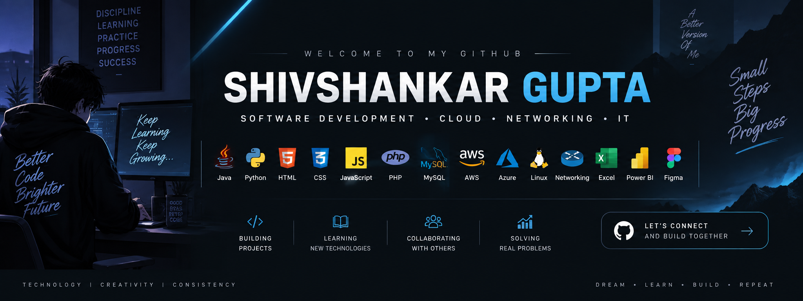

  

 

  Building Projects • Learning Technologies • Solving Problems • Growing Every Day

 

---

# 🚀 About Me

Hi! I'm **Shivshankar Gupta**, an aspiring software developer and technology enthusiast from India.

I enjoy learning new technologies, building projects, understanding IT infrastructure, and solving technical problems.

My learning journey covers:

---

# 💡 What I'm Currently Doing

---

# 🛠️ Technical Skills

## 💻 Programming Languages

---

# 🌐 Web Development

---

# 🗄️ Database & DBMS

---

# ☁️ Cloud Computing

I'm learning **Cloud Computing** and understanding how modern applications, infrastructure, storage, networking, security, and services work in cloud environments.

---

# 🌐 Networking & CCNA

---

# 🐧 Linux & Server Administration

---

# 🖥️ Operating Systems

---

# 🖥️ Computer Hardware

---

# 🎨 UI/UX & Figma

---

# 📊 Data & Analytics

---

# 🛠️ IT Support & Service Desk

---

# 🔧 Tools & Technologies

---

# 🎮 Gaming & Technology

> 🎮 Gaming keeps me curious.  
> 💻 Technology keeps me building.

---

# 📊 GitHub Activity

---

# 🐍 Contribution Activity

---

# 👀 Profile Visitors

---

# 🎯 My Goals

---

# 📚 My Learning Philosophy

## Learn → Build → Test → Improve → Repeat

 

> "Dream big, build bigger."

---

# 🤝 Let's Connect

I'm always interested in learning, collaborating, discussing technology, and building new projects.

 

---

### ⚡ "Consistency today builds a better tomorrow."

 

⭐ **Thanks for visiting my GitHub profile!**

